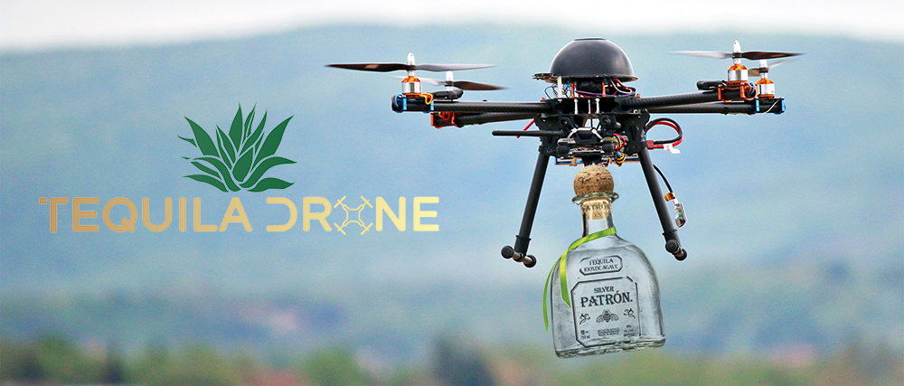

<div style="text-align:center"></div>

# Tequila-Drone
An embedded control unit for a tethered electrical model quad rotor aerial vehicle (the Quadrupel drone)

- [Course website](http://www.st.ewi.tudelft.nl/~koen/in4073/)

# Dependencies
Tequila Drone needs the following to be installed:

## pySerial
- Install with:
```sudo apt-get install python-serial```

## nCurses
The command line terminal uses the nCurses library. Get it from:
- Download ncurses-6.0.tar.gz [here](http://ftp.gnu.org/gnu/ncurses/).
- cd into ncurses-6.0
- If in Linux, use ```export CPPFLAGS="-P"```
- Then, ```./config```
- Finally, ```sudo make install```

## Redis 
- Install with:
```sudo apt-get install redis-server```